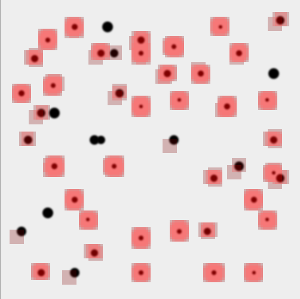

# 🎯 Hit Detector Model

This PyTorch-based CNN detects holes on boards or paper using a sliding window approach. It was trained on image patches of size **24×24**. The model scans larger images with this patch size to detect regions of interest.

> Holes or defects must approximately fit within a 20×20 region to be accurately detected.

 🤗 [Model Card on Hugging Face](https://huggingface.co/andrewromanenco/hit-detector).


## 📥 Model Inputs & Outputs
 
- Input: RGB or grayscale image (PIL.Image)
- Output: Annotated PIL.Image with red (or specified color) squares highlighting detected holes



## 🚀 Quick Start

### 🧠 Inference in Python

```python
from PIL import Image
from  pipeline  import  HitDetectorPipeline

pipe  =  HitDetectorPipeline("model.pt")

img  = Image.open("input.png")
result  =  pipe(img)
result.save("output.png")
print("✅ Output saved to output.png")
```

### 📦 Installation

```bash
pip install -r requirements.txt
```
## 🧪 Testing in Docker

To test the model or pipeline scripts inside a clean container:

```bash
cd <project folder>
docker run -it --rm -p 7860:7860 -v $PWD:/appx:rw romanenco/python-tool-chain /bin/bash
cd /appx
pip install -r requirements.txt
python test_pipeline.py
```

You should see output.png generated as a result.

### 🌐 Run Gradio UI

```bash
pip install gradio
python app.py
```

Open [http://127.0.0.1:7860](http://127.0.0.1:7860) to test the interactive web UI.

## 🛠 Retrain or Fine-Tune

To retrain the model on your own dataset, use the full pipeline and tools from the [main training repo](https://github.com/andrewromanenco/hit-detector), which includes:

- 📁 Tools to extract training patches from full images
- 🧠 Training script
- 📈 Inference script

## 📄 License

MIT
